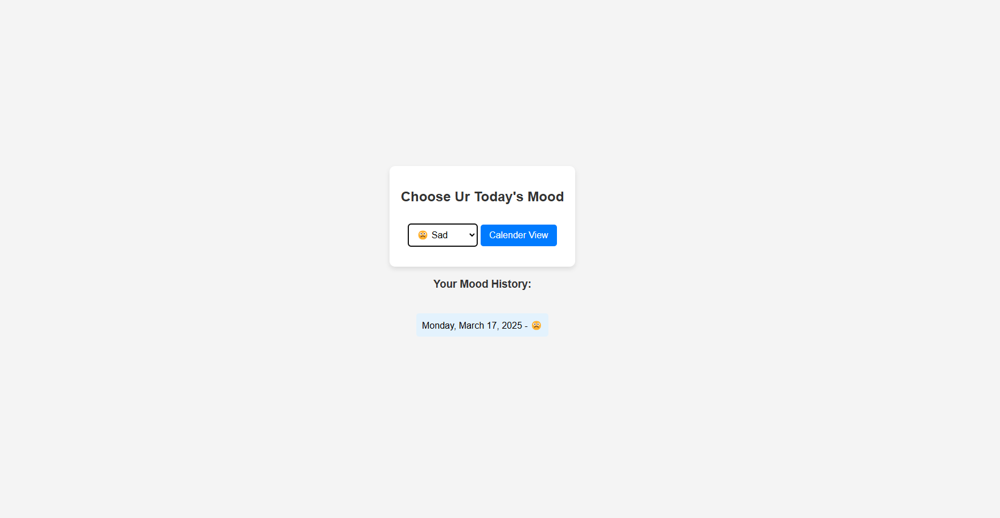
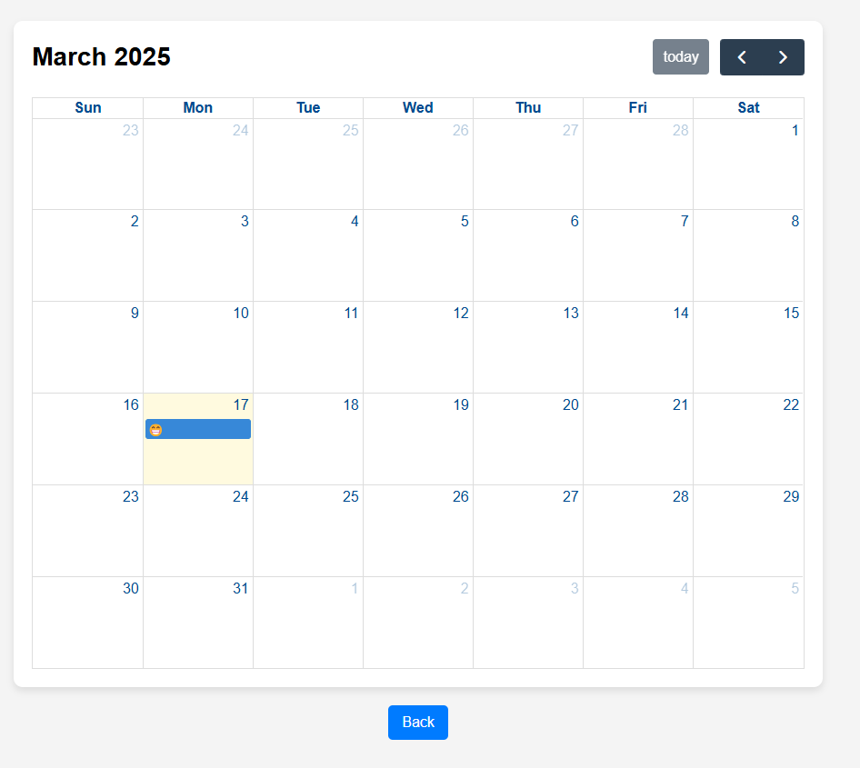

# Mood Tracker

## Overview
Mood Tracker is a simple web application that allows users to log their daily mood and view past moods in a calendar format. It provides an intuitive interface for tracking emotional trends over time.

## Features

- Select and log your mood for the day.
- View your mood history.
- Calendar view for visualizing past moods.

## Technologies Used

- **HTML**: Structure of the web pages.
- **CSS**: Styling for a clean and user-friendly UI.
- **JavaScript**: Handles logic for mood selection and calendar functionality.
- **FullCalendar.js**: Used for displaying moods in a calendar format.

## Installation & Usage

1. Clone this repository:
   ```sh
   git clone <repository-url>
   ```
2. Navigate to the project directory:
   ```sh
   cd JS-Assignment
   ```
3. Open `index.html` in a web browser to use the application.

## File Structure

```
JS-Assignment/
│── index.html        # Main page
│── style.css         # Styles for the main page
│── app.js            # JavaScript logic for mood tracking
│── calendar.html     # Calendar view
│── calender.css      # Styles for the calendar
│── calendar.js       # JavaScript for calendar functionality
│── Readme.md         # Project documentation
```

## Screenshots

### Home Page


### Calendar View


## License

This project is open-source and available under the MIT License.

## Author

Nikhil Rathore

